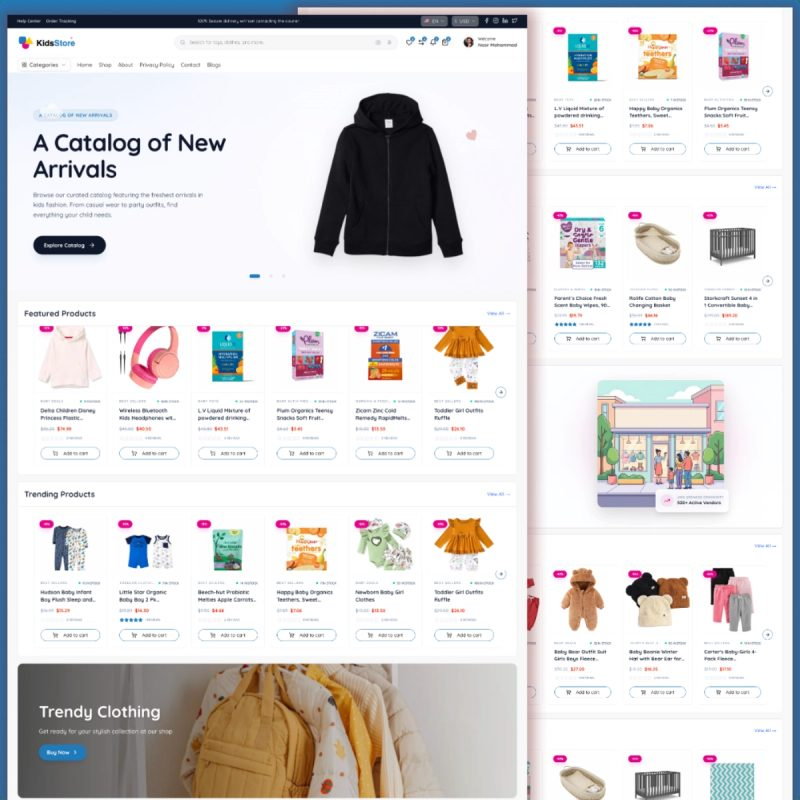
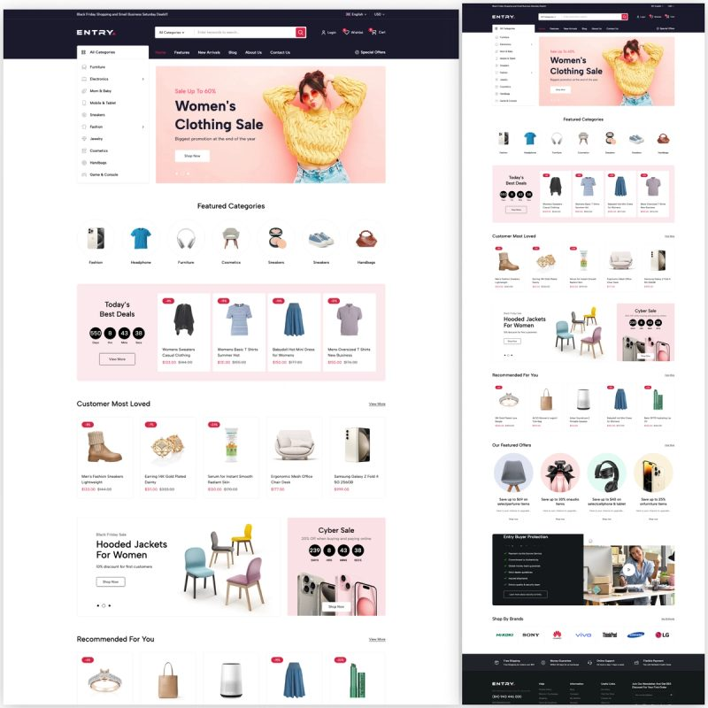
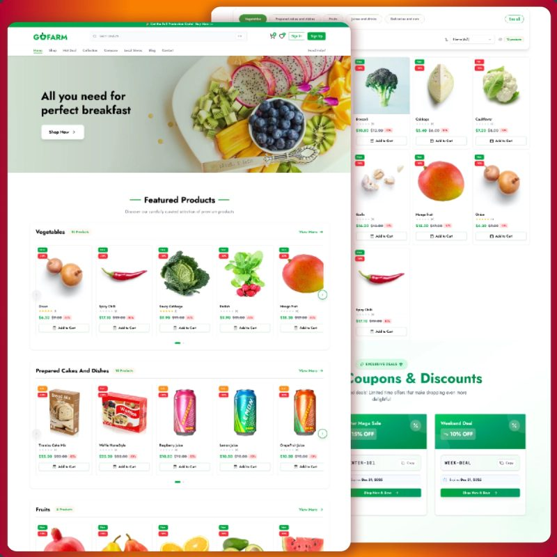
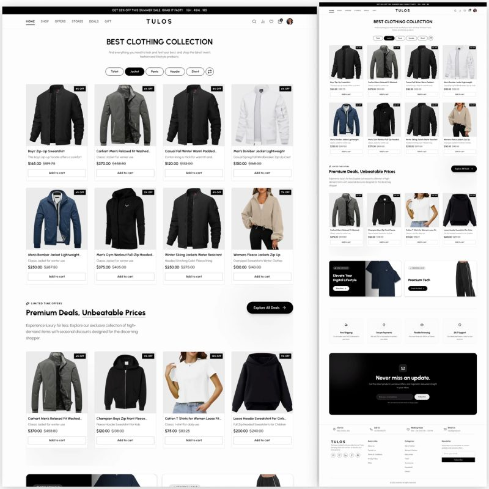
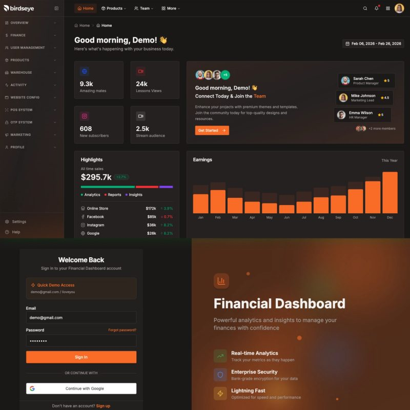
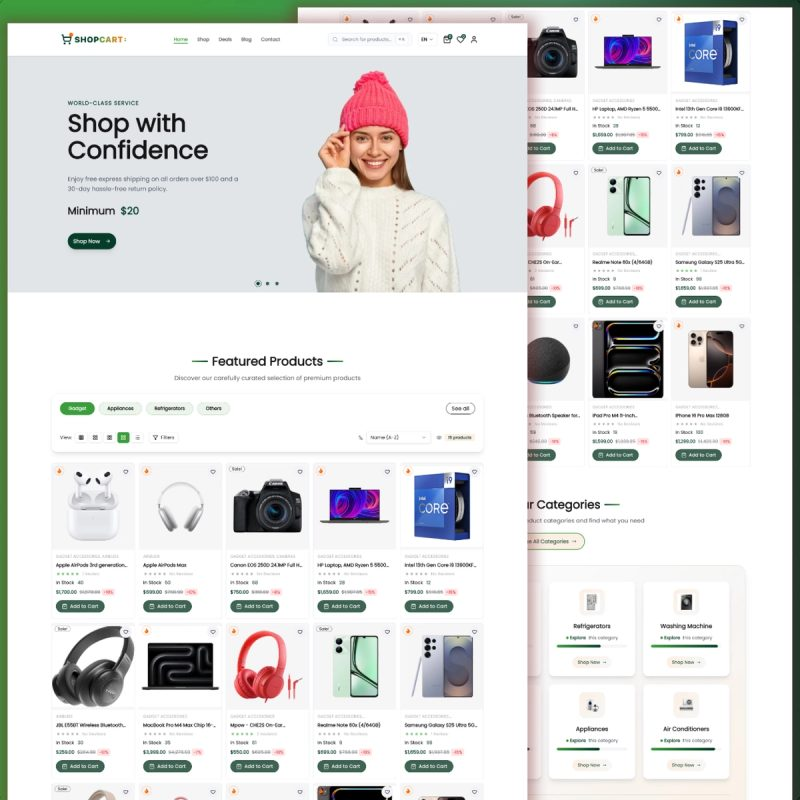
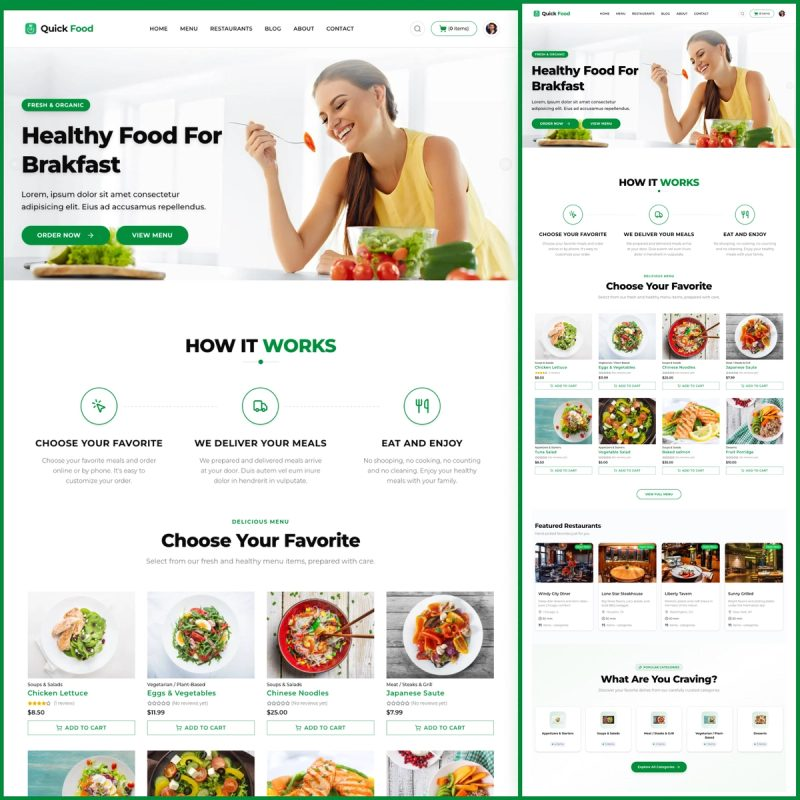
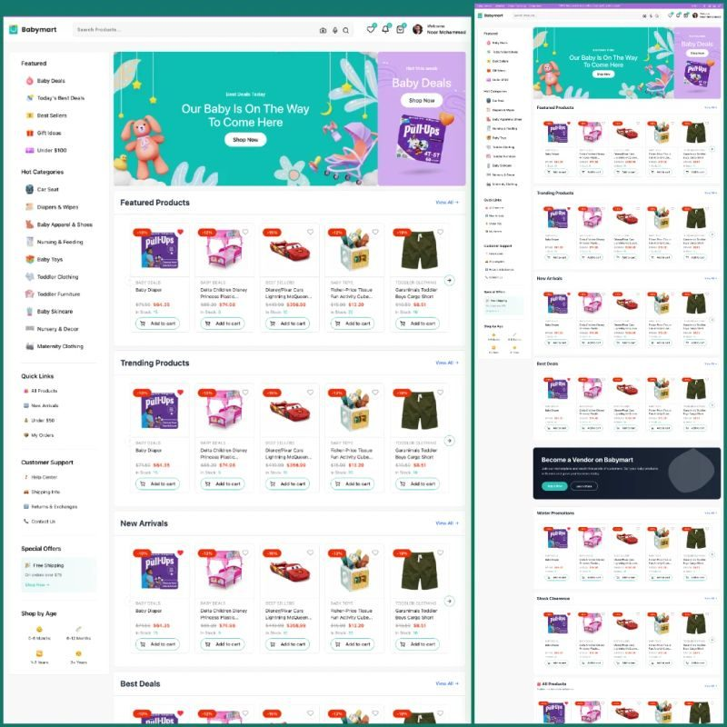
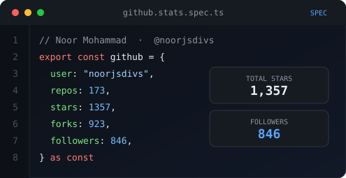
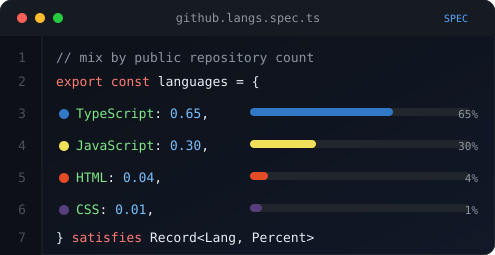

# Noor Mohammad

**Software Engineer** at [Arogga](https://arogga.com) · **CTO & Founder** at [ReactBD](https://reactbd.com)

I build production web and mobile products with **React**, **Next.js**, and **React Native** — then teach the same stack through real projects.

[Portfolio](https://noormohammad.reactbd.com/) · [ReactBD](https://reactbd.com/) · [YouTube](https://www.youtube.com/@reactjsBD) · [Blog](https://medium.com/@thebuildersplaybook/) · [npm](https://www.npmjs.com/~dev.noor_mohammad)

---

## About

Software engineer with 8+ years in React. At [Arogga](https://arogga.com) I ship healthcare products. At [ReactBD](https://reactbd.com) I run a studio that publishes production-ready Next.js kits, developer tools, npm packages, and long-form tutorials.

I care about shipping complete products: storefronts, admin dashboards, APIs, and React Native apps — not isolated UI demos.

- Building healthcare software at **Arogga**
- Shipping templates, tools, and courses at **ReactBD**
- Teaching full-stack React / Next.js / React Native on **YouTube** ([@reactjsBD](https://www.youtube.com/@reactjsBD))

---

## Featured work

Latest kits from [reactbd.com/en/projects](https://reactbd.com/en/projects). Preview and **Source** open the paid kit; **Live** is the demo only.

<table>
  <tr>
    <td width="50%" valign="top" align="center">
      
       
      <strong>Kids Store</strong> 
      Ecommerce — web, admin, and API 
      
      
    </td>
    <td width="50%" valign="top" align="center">
      
       
      <strong>Entry</strong> 
      Production full-stack ecommerce monorepo 
      
      
    </td>
  </tr>
  <tr>
    <td width="50%" valign="top" align="center">
      
       
      <strong>GoFarm Pro</strong> 
      Next.js 16 multi-vendor agricultural store 
      
      
    </td>
    <td width="50%" valign="top" align="center">
      
       
      <strong>Tulos</strong> 
      Full-stack ecommerce — Next.js 16 + Tailwind v4 
      
      
    </td>
  </tr>
  <tr>
    <td width="50%" valign="top" align="center">
      
       
      <strong>Bird's Eye</strong> 
      Next.js 16 SaaS / ERP boilerplate 
      
      
    </td>
    <td width="50%" valign="top" align="center">
      
       
      <strong>Shopcart Pro</strong> 
      Ecommerce with admin and employee dashboards 
      
      
    </td>
  </tr>
  <tr>
    <td width="50%" valign="top" align="center">
      
       
      <strong>Quick Food</strong> 
      Food delivery — Next.js 16, Sanity, Stripe 
      
      
    </td>
    <td width="50%" valign="top" align="center">
      
       
      <strong>BabyMart</strong> 
      Web + mobile + admin + API monorepo 
      
      
    </td>
  </tr>
</table>

All projects, source, and kits: [reactbd.com/en/projects](https://reactbd.com/en/projects) · [shop](https://buymeacoffee.com/reactbd/extras)

---

## Stack

  
  
  

 

**Frontend** — HTML, CSS, JavaScript, TypeScript, React, Next.js, Redux, Tailwind CSS  
**Mobile** — React Native, Expo  
**Backend** — Node.js, Express, REST, GraphQL  
**Data** — MongoDB, PostgreSQL, Prisma, Firebase, Redis, Sanity  
**Platform** — Vercel, Netlify, Docker, AWS, GCP, GitHub Actions, Figma, VS Code

---

## Products & packages

Things people can use today, not just watch.

- **[ReactBD](https://reactbd.com/)** — projects, tools, and tutorials for shipping React / Next.js products
- **[Portfolio](https://noormohammad.reactbd.com/)** — selected work and services
- **[QR / barcode generator](https://generator.reactbd.com/)** — runs in the browser, no upload
- **[JSON workspace](https://json.reactbd.com/)** — format, validate, compare, and mock data locally
- **[Pattern Craft](https://bg.reactbd.com/)** — copy-ready CSS / Tailwind backgrounds

**npm** ([@dev.noor_mohammad](https://www.npmjs.com/~dev.noor_mohammad))

- [react-native-toast-message-ts](https://www.npmjs.com/package/react-native-toast-message-ts) — typed toasts for React Native / Expo
- [react-native-voice-ts](https://www.npmjs.com/package/react-native-voice-ts) — speech-to-text for iOS and Android
- [ts-bcrypt](https://www.npmjs.com/package/ts-bcrypt) — password hashing on Node crypto, no native bindings
- [currency-formatter-bd](https://www.npmjs.com/package/currency-formatter-bd) — BDT formatting and parsing
- [js-isarray](https://www.npmjs.com/package/js-isarray) · [chalk-ts](https://www.npmjs.com/package/chalk-ts) · [lodash-updated](https://www.npmjs.com/package/lodash-updated)

---

## GitHub

Public profile spec — `github.stats.spec.ts` and `github.langs.spec.ts`.

<table>
  <tr>
    <td width="50%">
      
    </td>
    <td width="50%">
      
    </td>
  </tr>
</table>

  

---

## Connect

  
  
  
  
  
  
  
  

Hire / collaborate: [noormohammad.reactbd.com](https://noormohammad.reactbd.com/) · [reactbd.com](https://reactbd.com/)

If the tutorials or repos help you, you can support the work:

